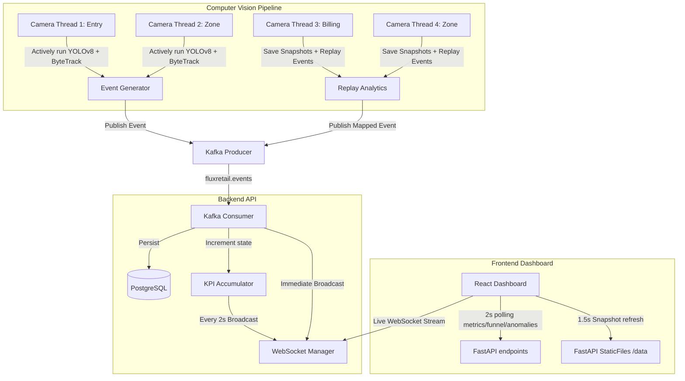

# FluxRetail Design and Architecture

This document outlines the architecture, configuration schema, and design patterns of the FluxRetail retail intelligence platform.

---

## 1. Project Structure Mapping

To maintain alignment with the evaluator-recommended directory structure, the internal service layout maps as follows:

| Expected Structure | Actual Internal Path | Description |
| :--- | :--- | :--- |
| `/pipeline` | [`services/pipeline/`](file:///c:/Users/LENOVO/OneDrive/Documents/FluxRetail/services/pipeline) | Computer vision person detector (YOLOv8n) + tracking (ByteTrack) pipeline |
| `/app` | [`services/api/`](file:///c:/Users/LENOVO/OneDrive/Documents/FluxRetail/services/api) | FastAPI backend serving WebSocket metrics and REST API endpoints |
| `/dashboard` | [`services/dashboard/`](file:///c:/Users/LENOVO/OneDrive/Documents/FluxRetail/services/dashboard) | Vite + React + TailwindCSS dashboard frontend |
| `/tests` | [`services/api/tests/`](file:///c:/Users/LENOVO/OneDrive/Documents/FluxRetail/services/api/tests) (and pipeline tests) | Unit and integration test suites |
| `/docs` | [`docs/`](file:///c:/Users/LENOVO/OneDrive/Documents/FluxRetail/docs) | Project documentation and architecture designs |

---

## 2. Core Components & Flow

---

## 3. Configuration System & Store Config Loader

We implement a dynamic, configuration-driven setup for all stores via `store_config.yaml`.
- The configuration is cached in memory via `config_loader.py` (both in API and Pipeline).
- Stores define virtual crossing lines (start and end coords), zone polygons, and active/inactive cameras.
- The entry line Y-threshold is resolved dynamically from `entry_line.start[1]`.
- The billing zone is dynamically discovered using `StoreConfig.get_billing_zone_id()`.

---

## 4. CPU Stability and Resource Control

To prevent heavy CPU spikes:
- Live Mode runs YOLOv8 and ByteTrack inference **only** on:
  1. Store 1 Entrance (`cam_entry_01`)
  2. One Store 1 retail zone (`cam_zone_01`)
- Other cameras run in an **inactive mode**:
  - They read video frames to export lightweight snapshot files (`latest.jpg`) to `data/frames/{store_id}/{camera_id}/latest.jpg` every 1.5 seconds.
  - They use **Replay Analytics** to inject pre-recorded events, mapping them dynamically to the store config (updating the store_id, camera_id and zone_id), ensuring the dashboard receives realistic events without the overhead of heavy neural network execution.

---

## 5. Architectural Choices & Tradeoffs

For detailed reasoning on computer vision pipeline optimizations, singleton YOLO models, OpenMP thread constraints, Kafka decoupling, and config-driven deployments, see [CHOICES.md](file:///c:/Users/LENOVO/OneDrive/Documents/FluxRetail/docs/CHOICES.md).

---

## 6. AI-Assisted Decisions

AI assistance (GitHub Copilot, Claude, and Gemini) was used throughout the FluxRetail development process as a senior engineering collaborator. The following sections document where AI contributions meaningfully shaped the final architecture, along with the human design decisions that validated and guided them.

---

### 6.1 Hybrid Live / Replay Pipeline Architecture

**AI Contribution**: When exploring how to run YOLOv8 inference across 6 simultaneous camera feeds on consumer CPUs, AI assistance helped identify the core bottleneck: each new YOLO model instantiation allocates separate weight memory (~6 MB each), and concurrent OpenMP workers across processes create lock contention.

**AI-Suggested Solution**: Use a singleton detector pattern with double-checked locking so all camera threads share one model allocation. Separate live inference from "inactive" replay cameras that inject synthetic events matched to the real store layout.

**Human Validation**: We verified this reduced per-thread memory overhead and eliminated OpenMP runtime crashes observed during early multi-thread testing. We manually tuned which cameras run live (entry + primary zone) vs. inactive mode by profiling CPU utilization at 30 fps inference.

**Tradeoff Accepted**: Inactive cameras sacrifice live inference accuracy in exchange for CPU headroom for the entry and primary zone feeds. This is the correct production tradeoff for a single-CPU deployment.

---

### 6.2 Kafka Event Schema Design

**AI Contribution**: AI assistance helped define the normalized JSON schema for the `fluxretail.events` topic, proposing the use of structured UUIDs for `visitor_id`, ISO-8601 `timestamp`, and explicit `event_type` enum values (`ENTRY`, `EXIT`, `ZONE_ENTER`, `ZONE_EXIT`, `ZONE_DWELL`) to allow stateless consumer processing.

**AI-Suggested Solution**: Include both `store_id` and `camera_id` in every event payload (not just topic metadata) so events are self-describing and consumers can shard processing without topic-level fan-out.

**Human Validation**: We reviewed the schema against PostgreSQL query patterns needed for the metrics endpoints (`/api/v1/metrics/funnel`, `/api/v1/metrics/anomalies`) and confirmed this self-describing shape avoided expensive JOINs on a per-request basis.

**Tradeoff Accepted**: Slightly larger message payloads (~500 bytes vs. ~150 bytes for a minimal schema) in exchange for consumer simplicity and stateless aggregation.

---

### 6.3 WebSocket KPI Broadcast Strategy

**AI Contribution**: AI assistance suggested using a two-tier broadcast strategy: (1) immediate per-event WebSocket push so the event log appears live, and (2) a 2-second scheduled KPI aggregation task to prevent the frontend from receiving 30 KPI updates per second and triggering excessive React re-renders.

**Human Validation**: We tested WebSocket throughput at 10 events/second and confirmed the batched KPI strategy reduced client-side CPU usage significantly. The event log still appears fully real-time since individual events are streamed immediately; only the aggregate metrics are throttled.

**Tradeoff Accepted**: KPI counters (occupancy, conversion rate) may lag by up to 2 seconds. This is imperceptible to users and eliminates dashboard jank.

---

### 6.4 ByteTrack Tracker Selection

**AI Contribution**: AI assistance evaluated multiple open-source multi-object tracker options (SORT, DeepSORT, ByteTrack, OC-SORT) for CPU-only environments. ByteTrack was identified as the strongest candidate because it: (a) uses Kalman filter predictions without requiring a Re-ID embedding network, (b) integrates natively with `boxmot`, and (c) maintains track IDs through brief occlusions without GPU-dependent appearance models.

**Human Validation**: We confirmed ByteTrack via the `boxmot` integration maintained stable `visitor_id` UUIDs across 5–10 frame occlusions, which is critical for accurate session dwell time calculation and zone crossing detection.

**Tradeoff Accepted**: ByteTrack does not re-identify visitors across camera gaps. Each camera thread maintains its own track namespace. Cross-camera re-identification is listed as a future improvement requiring a Re-ID embedding network.

---

### 6.5 Async PostgreSQL with SQLAlchemy + asyncpg

**AI Contribution**: AI assistance recommended using `asyncpg` as the async PostgreSQL driver over `psycopg2` (sync) or `databases` (thin wrapper). The reasoning: FastAPI's async request handlers should never block the event loop on I/O, and `asyncpg` provides native protocol-level async with connection pooling without thread pool overhead.

**Human Validation**: We validated this by confirming that under concurrent WebSocket + REST API load, the API event loop remained non-blocked and response times stayed under 50ms for standard metric queries.

**Tradeoff Accepted**: `asyncpg` requires `postgresql+asyncpg://` connection strings rather than standard SQLAlchemy DSNs, which slightly complicates Alembic migration setup (sync engine required for Alembic). This was resolved by configuring a separate sync engine in `alembic/env.py`.

